<a id="top"></a>
# GeoAlquiler

[Español](./README.md) | **English**

### Real Estate Intelligence and Spatial Analysis for the Rental Market


[](https://github.com/pdawgabriel-hub/geo-alquiler/actions/workflows/ci.yml)

---

## Table of Contents

- [Overview](#overview)
- [Architecture](#architecture)
- [Key Features / Modules](#key-features)
  - [1. Spatial Exploration](#spatial-exploration)
  - [2. Analytics & Machine Learning](#analytics-ml)
  - [3. Investment Tools](#investment-tools)
  - [4. Spain Rental Observatory](#observatory)
- [Screenshots](#screenshots)
- [Data Source](#data-source)
- [Getting Started](#getting-started)
- [Quality & Tests](#quality-tests)
- [Technical Documentation](#technical-documentation)
- [License](#license)
- [Author](#author)

---

<a id="overview"></a>
## Overview

**GeoAlquiler** is an analytical web application built in **R** with **Shiny**, designed to turn raw rental listing data into **actionable market intelligence**. The project combines geolocation, data science, and financial decision-making tools into a single interactive dashboard, allowing a user (investor, analyst, or individual) to answer questions such as:

- Where are the areas with the best price/m² ratio in a city?
- What would be a "fair" market price for a property with a given set of characteristics?
- Which listings in the dataset stand out as investment opportunities compared to the rest of the market?
- What would be the estimated return and cash flow if I buy a specific property to rent it out?
- In which Spanish municipalities does rent take the largest share of household income?

To achieve this, GeoAlquiler is built on three pillars, plus a nationwide observatory:

1. **Spatial Exploration** — visualize and filter the property stock on an interactive map.
2. **Analytics & Machine Learning** — extract patterns, generate price predictions, and recommend similar properties.
3. **Investment Tools** — turn the data into concrete buy/rent decisions through calculators and comparisons.
4. **Spain Rental Observatory** — a choropleth map of Spain's ~8,200 municipalities that cross-references the Ministry of Housing's official rental index (SERPAVI) with INE income and population data and the Cadastre's housing stock.

### How it's built

The app is organized in three layers that don't mix, so every change has an obvious place (the full diagram is in [Architecture](#architecture)):

- **Offline ingestion** (`scripts/ingesta/`). Downloading, cleaning and joining the sources is done by hand with `Rscript scripts/ingesta/run_pipeline.R`, never inside the app. The output is two Parquet files that ship with the package, so the app starts fast and doesn't depend on any external website being up. If a source changes format, the pipeline fails with an explicit error instead of the app failing in production.
- **Business logic without Shiny** (`R/fct_*.R`). The calculations that matter (indicators, municipality name matching, number formatting, map geometry) are pure functions shared by the pipeline and the app, and they're tested with `testthat` without starting a server.
- **Module-based interface** (`R/mod_*.R`). Each screen is an independent module. `app_server.R` only wires them together and decides which version of the data each one receives, which is the app's central design decision:

| The module receives… | Modules | Why |
|---|---|---|
| `datos_visibles`: filters + what's visible on the map | Table, Analytics, Statistics, Opportunities, Calculator, Report, Export | They answer "what am I looking at right now" |
| Filtered data, not cropped to the map | KNN Recommender | Searching for similar listings only within the map view would leave very few candidates |
| Full dataset | Comparator, Prediction, Neighborhoods, Favorites | They need the whole market: training the model, comparing cities, not losing favorites when filtering |
| Its own dataset | Observatory | Official data aggregated by municipality, independent of the filters |

Heavy lifting happens on the server, and only what will be drawn reaches the browser (see [how it loads fast](docs/GUIA_TECNICA.md#rendimiento) in the technical guide, in Spanish).

The project is designed as a **technical portfolio piece**, demonstrating mastery of Shiny application architecture at the R-package level (the `{golem}` framework), modularization, testing best practices, and a product-oriented approach to a real use case (PropTech / Real Estate Analytics). Per-zone prices come from real sources (Generalitat de Catalunya, Generalitat Valenciana, Basque Government) or, where no official source exists, from published indices documented by hand (see `scripts/ingesta/`).

[⬆ Back to top](#top)

---

<a id="architecture"></a>
## Architecture


[⬆ Back to top](#top)

---

<a id="key-features"></a>
## Key Features / Modules

The application is organized into three functional blocks, directly reflected in the interface's navigation (`sidebarMenu`), plus the Rental Observatory (its own menu entry, right below the Main Dashboard) and an informational section:

<a id="spatial-exploration"></a>
### 1. Spatial Exploration

| Module | Description |
|---|---|
| **Main Dashboard** | KPI overview with average price, average surface area, price per m², and total available properties based on the active filters. |
| **Interactive Map** (`mod_mapa`) | Map built with `leaflet`/`leaflet.extras`, geolocating each property and featuring a **heatmap layer** that visually reveals price and supply concentration by area. |
| **Global Filters Panel** (`mod_filtros`) | Collapsible horizontal filter bar (city, property type, price range, surface area, number of rooms, etc.) that reactively feeds **every** module in the application. |
| **Data Explorer** (`mod_tabla`) | Interactive table (`DT`) of the filtered listings, with a visual favorites indicator and result export. |
| **Neighborhood Analysis** (`mod_barrios`) | Zonal analytics: price dispersion, average value per m², and supply volume broken down by district/neighborhood within each city. |
| **My Favorites** (`mod_favoritos`) | Management of a list of properties bookmarked by the user during the session, with its own KPIs (average price of favorites, total saved, etc.). |
| **Export Data** (`mod_exportar`) | CSV download of the filtered subset of listings. |

<a id="analytics-ml"></a>
### 2. Analytics & Machine Learning

| Module | Description |
|---|---|
| **Visual Analytics** (`mod_graficos`) | Interactive `plotly` visualizations: price vs. surface area relationship, price distribution, and graphical market comparisons. |
| **Advanced Statistics** (`mod_estadistica`) | Statistical summary of the filtered market: median, percentiles, boxplots, and other dispersion measures to understand the real price distribution (beyond the average). |
| **ML Prediction** (`mod_prediccion`) | Predictive price model (regression) trained on the dataset, estimating the expected rent for a property based on city, neighborhood, property type, surface area, and number of rooms entered by the user. |
| **KNN Recommender** (`mod_recomendador`) | Recommendation system based on the **K-Nearest Neighbors** algorithm: given a reference property, it suggests the most similar listings in the dataset based on their characteristics. |

<a id="investment-tools"></a>
### 3. Investment Tools

| Module | Description |
|---|---|
| **A/B Comparator** (`mod_comparador`) | Head-to-head comparison between two cities, neighborhoods, or property types, useful for deciding between two alternative markets or segments. |
| **Opportunity Detector** (`mod_oportunidades`) | Automatically identifies listings that deviate favorably from the market average (e.g., price below what's expected for their area/type), flagging them as potential investment opportunities. |
| **Profitability Calculator** (`mod_calculadora`) | Complete financial calculator: gross/net yield, mortgage amortization, and cash flow projection based on purchase price, estimated rent, and maintenance costs. |
| **Executive Report** (`mod_reporte`) | Generation and download of a report (based on the `reporte_plantilla.Rmd` template) with the market's key metrics and the filtered listings, ready to share or print. |

<a id="observatory"></a>
### 4. Spain Rental Observatory

| Module | Description |
|---|---|
| **Spain Observatory** (`mod_observatorio`) | Municipal choropleth map of all of Spain (or a single province) with 8 selectable indicators, KPIs for the selected area, a profile card for each municipality showing its national percentile on every indicator, an income vs. rent €/m² bubble chart (size = population, color = rent burden), and a municipality ranking. A municipality can be selected from the map, the chart, or the ranking, and all three views stay in sync. |

Unlike the rest of the app (which works with illustrative listings for 5 cities), the observatory uses **only official aggregate data**, joined by INE municipality code and **all referring to the same year (2022)**, so ratios between sources compare the same period:

| Indicator | Source | Calculation |
|---|---|---|
| Median rent (€/m² and €/month) | SERPAVI — Ministry of Housing and Urban Agenda | Median of rental contracts declared in personal income tax returns. The apartment-building median is used; where SERPAVI only publishes it for single-family homes (749 municipalities, e.g. Torrent), that one is used and the profile card says so |
| Rent burden (% of income) | SERPAVI + INE | 12 × median monthly rent / average net household income |
| Average net household income | INE — Household Income Distribution Atlas (ADRH) | Direct value |
| Rented homes (% of housing stock) | SERPAVI + Cadastre | Homes with declared rental income / residential-use properties |
| Average cadastral value per residential property | Cadastre — Urban Real Estate Cadastre statistics | Residential cadastral value / number of residential properties |
| Population and population growth | INE — Municipal Register (Padrón) | 2022 population and change from 2022 to the latest published year |

The Basque Country and Navarre have no rent or Cadastre data (regional tax regime), and municipalities with very few declared contracts have no median rent. When a value is missing, the municipality's profile card explains why. Details on the sources, how they're joined and their limitations are in the [technical guide](docs/GUIA_TECNICA.md#pipeline-observatorio) (in Spanish).

[⬆ Back to top](#top)

---

<a id="screenshots"></a>
## Screenshots

Below are the application's main screens, organized by the same functional blocks as the navigation. Replace each placeholder with your own screenshot following the guide in the next section.

### Spatial Exploration

| Main Dashboard |
|---|
| 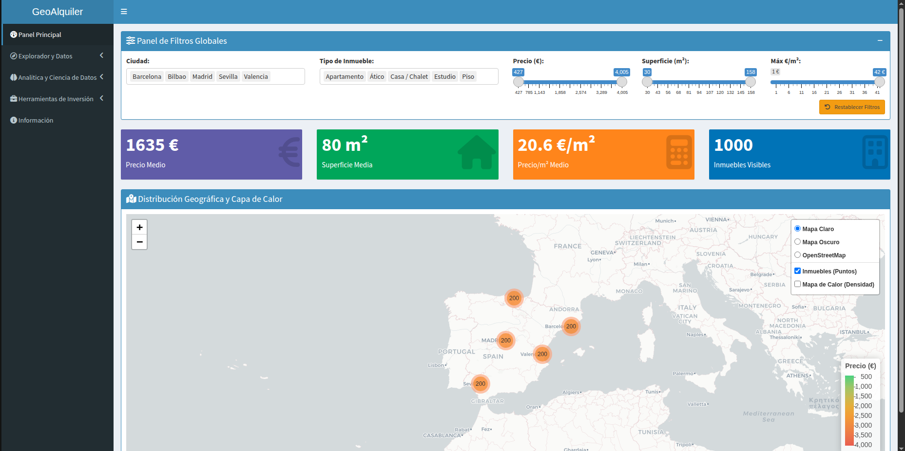 |

| Data Explorer | Neighborhood Analysis |
|---|---|
| 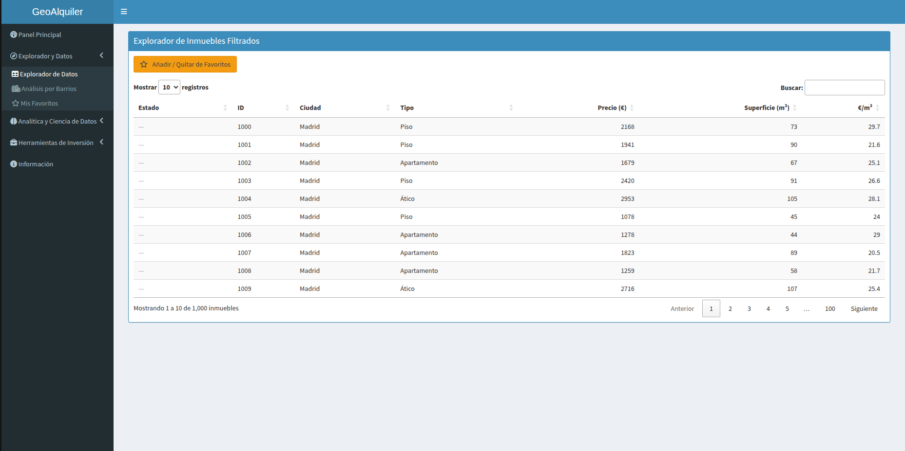 | 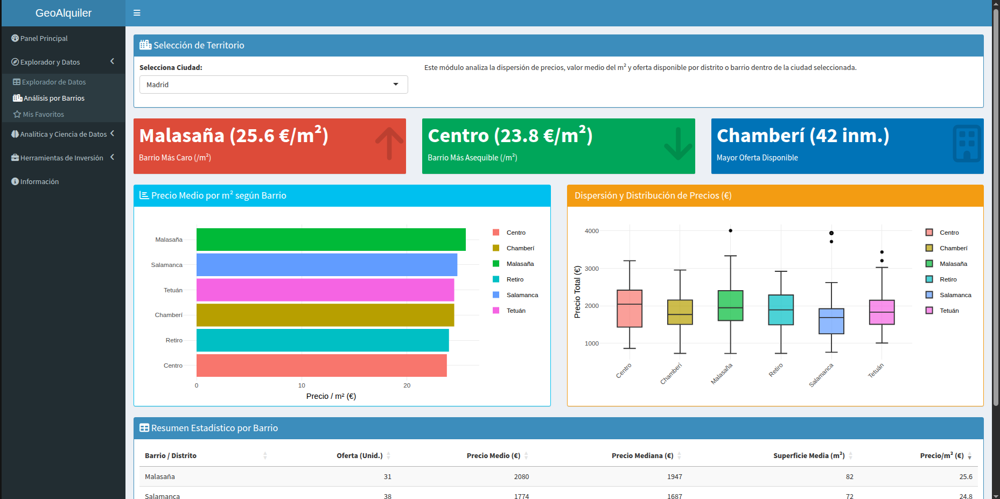 |

### Analytics & Machine Learning

| Visual Analytics | ML Prediction |
|---|---|
| 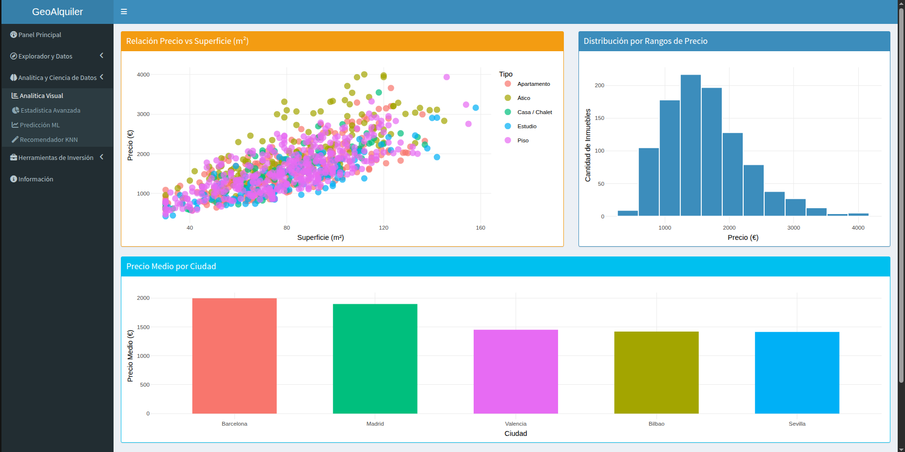 | 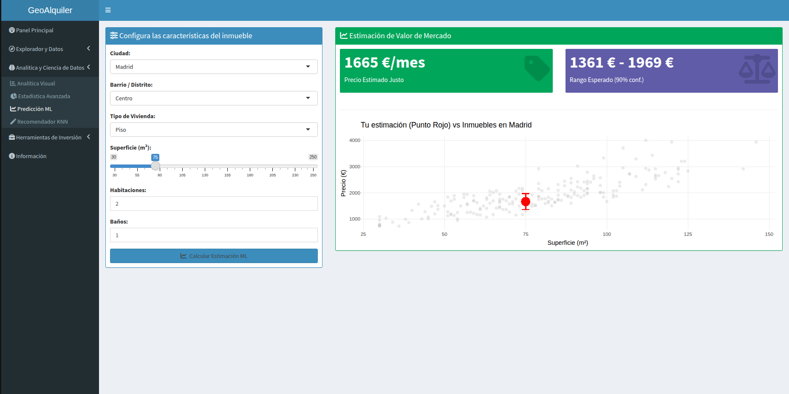 |

| KNN Recommender | Advanced Statistics |
|---|---|
| 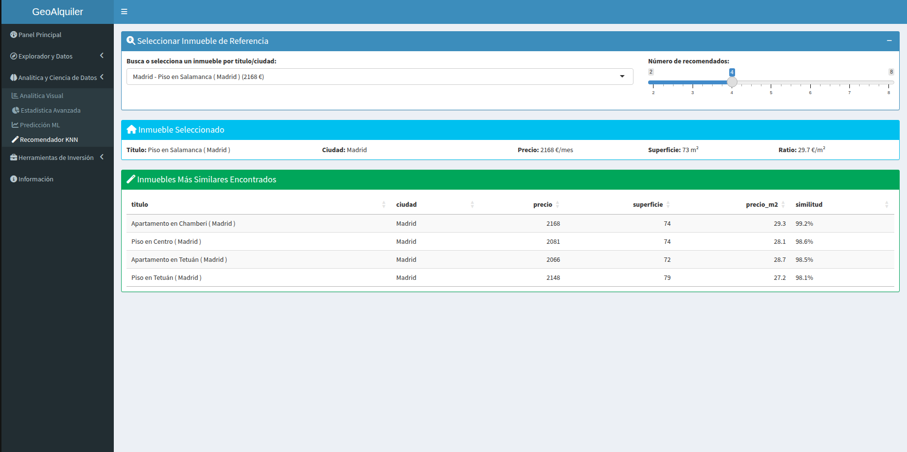 | 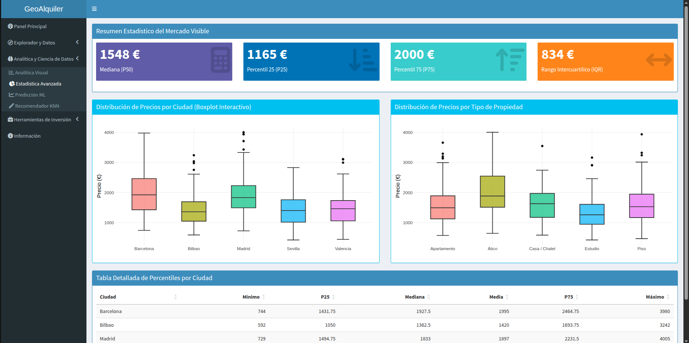 |

### Investment Tools

| A/B Comparator | Opportunity Detector |
|---|---|
| 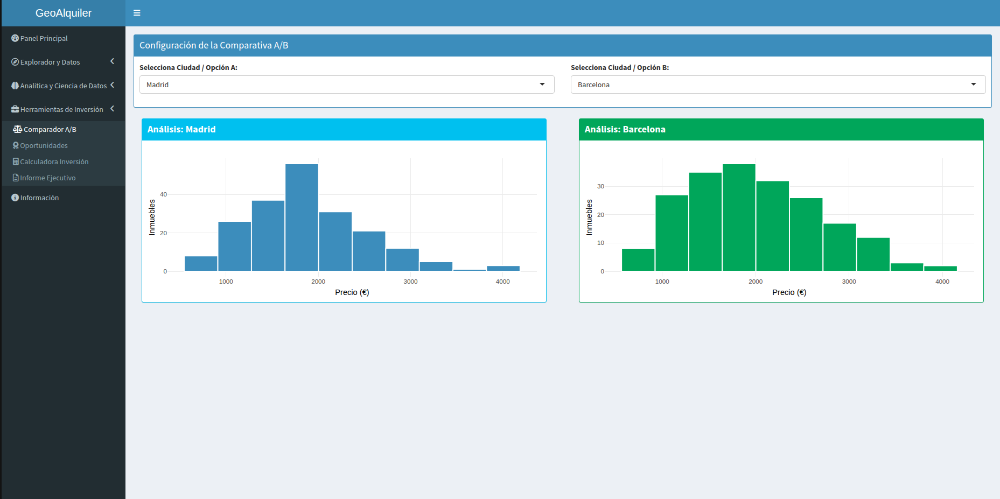 | 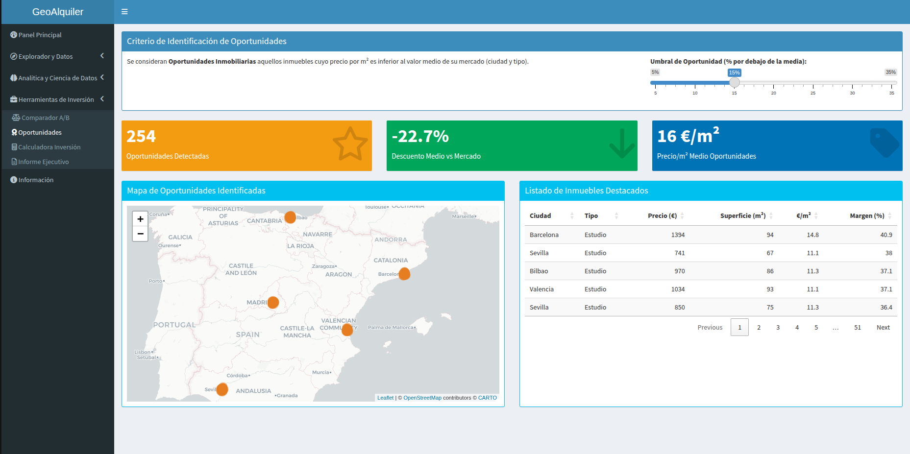 |

| Profitability Calculator | Executive Report |
|---|---|
| 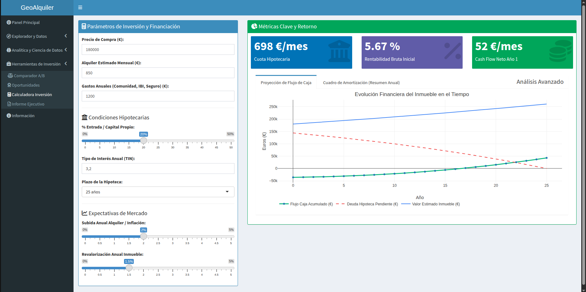 | 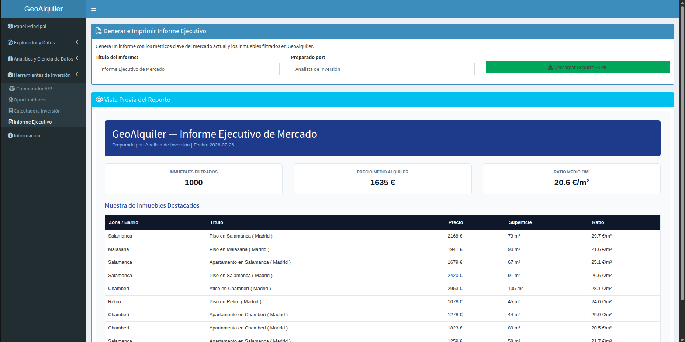 |

### Spain Rental Observatory

| Observatory (rent €/m² by municipality, Madrid profile card) |
|---|
| 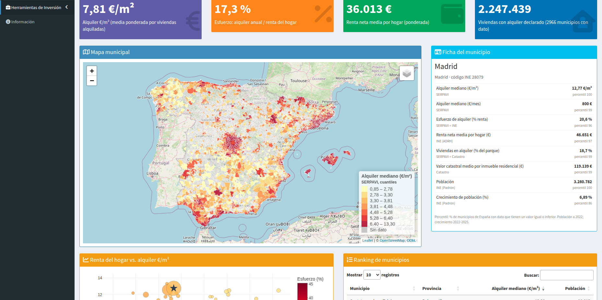 |

---

<a id="data-source"></a>
## Data Source

All data comes from real sources and is prepared by an offline pipeline (`scripts/ingesta/`), never inside the app.

**Listings** (`inst/app/data/alquileres.parquet`): each zone's price/m² comes from the most granular official source available for each city. Individual listings are an illustration generated within each zone, but their price always starts from the real €/m².

| City | Source | Detail |
|---|---|---|
| **Barcelona** | Generalitat de Catalunya (INCASÒL), rental deposits | By neighborhood |
| **Bilbao** | Basque Government (Etxebide), quarterly EMAL report | By neighborhood |
| **Valencia** | Generalitat Valenciana, rental deposit registry | By postal code |
| **Madrid, Sevilla** | No public source with amount and geography (verified) | Documented manual anchor, flagged as estimated |

**Observatory** (`inst/app/data/observatorio_municipios.parquet`): SERPAVI (Ministry of Housing and Urban Agenda), INE (Household Income Distribution Atlas and Municipal Register) and the Cadastre, joined by INE municipality code and all referring to 2022.

How each source is downloaded and joined, the data schema and how to regenerate it: [technical guide, section 4](docs/GUIA_TECNICA.md#pipeline) (in Spanish).

[⬆ Back to top](#top)

---

<a id="getting-started"></a>
## Getting Started

You need **R ≥ 4.1**. From the project root:

```bash
git clone https://github.com/pdawgabriel-hub/geo-alquiler.git
cd geo-alquiler
Rscript -e 'renv::restore()'                         # installs the exact versions in renv.lock
Rscript app.R                                        # launches the app
Rscript -e 'testthat::test_dir("tests/testthat")'    # runs the tests
```

From RStudio: open `geo-alquiler.Rproj`, accept restoring the environment and click **Run App** on `app.R`. The app doesn't download anything at startup: the pre-built data ships in `inst/app/data/`.

The app is deployed at **[pdawgabriel-hub.shinyapps.io/geoalquiler](https://pdawgabriel-hub.shinyapps.io/geoalquiler/)**.

[⬆ Back to top](#top)

---

<a id="quality-tests"></a>
## Quality & Tests

The business calculations (KPIs, mortgage and investment projection, opportunity detection, recommender similarity, Observatory indicators, matching municipality names across sources…) are pure functions in `R/fct_*.R`, kept apart from the interface, and are tested directly:

- **29 tests with 102 assertions** (`tests/testthat/`), using reference values worked out by hand (e.g. the monthly payment on a €200,000 mortgage over 30 years at 3%), edge cases, and every bug already fixed so it can't come back.
- **Modules tested with `testServer()`**, without a browser, to check that each screen passes its data to the calculations correctly.
- **Continuous integration with GitHub Actions**: on every push, GitHub installs the exact versions in `renv.lock` from scratch and runs all the tests. The **Tests** badge at the top shows the result for the latest commit.

How the tests are organized, how to write a new one and how the workflow works: [technical guide, sections 8 and 9](docs/GUIA_TECNICA.md#tests) (in Spanish).

[⬆ Back to top](#top)

---

<a id="technical-documentation"></a>
## Technical Documentation

The **[technical guide](docs/GUIA_TECNICA.md)** (in Spanish) explains the code in depth:

- Project structure and `{golem}` package conventions.
- Data flow inside the app: which data each module receives and why.
- A walkthrough of the code: what a module looks like, how calculations are kept apart from the interface, and how the server talks to the browser, with real snippets.
- The data pipeline step by step, with the dataset schema and how the Observatory's sources are joined.
- Performance optimizations, especially how the Observatory loads ~8,200 polygons.
- Detailed installation (RStudio and terminal) and known issues.
- Tests, continuous integration (including how to reproduce it locally) and deployment.
- Where to make the most common changes.

[⬆ Back to top](#top)

---

<a id="license"></a>
## License

This project is published as a **personal portfolio piece** and carries a restricted-use license. Specifically:

- You **may view, clone, and run** the code for **learning, technical evaluation, or portfolio review purposes** (for example, as part of a hiring process or to study the project's architecture).
- You **may modify and run copies of the code for personal, non-commercial use**, always crediting the original authorship.
- **Commercial use of the project is not permitted**, in whole or in part (including deploying it as a product or service, reselling it, or integrating it into third-party commercial solutions) without the author's express authorization.
- **The sole rights-holder entitled to commercially exploit the project is the original author**, [Gabriel](https://github.com/pdawgabriel-hub) (author and developer of GeoAlquiler).

The full legal text can be found in the [`LICENSE.en.md`](./LICENSE.en.md) file (Spanish version: [`LICENSE.md`](./LICENSE.md)).

[⬆ Back to top](#top)

---

<a id="author"></a>
## Author

Developed by **Gabriel Iborra Vicente** as a portfolio project, with the goal of demonstrating the development of professional-grade Shiny applications structured as an R package (`{golem}`), combining geospatial analytics, Machine Learning models, and real estate investment decision-making tools.

[⬆ Back to top](#top)