<a id="top"></a>
# GeoAlquiler

**Español** | [English](./README.en.md)

### Inteligencia Inmobiliaria y Análisis Espacial del Mercado de Alquiler


---

## Índice

- [Descripción General](#descripcion-general)
- [Características Principales / Módulos](#caracteristicas-principales)
  - [1. Exploración Espacial](#exploracion-espacial)
  - [2. Analítica & Machine Learning](#analitica-ml)
  - [3. Herramientas de Inversión](#herramientas-inversion)
- [Capturas de Pantalla](#capturas-pantalla)
- [Estructura del Proyecto (`{golem}`)](#estructura-proyecto)
- [Requisitos e Instalación](#requisitos-instalacion)
- [Uso y Ejecución](#uso-ejecucion)
- [Uso desde la Terminal (sin RStudio)](#uso-terminal)
- [Testing & Calidad](#testing-calidad)
- [Despliegue](#despliegue)
- [Licencia](#licencia)
- [Autor](#autor)

---

<a id="descripcion-general"></a>
## Descripción General

**GeoAlquiler** es una aplicación web analítica construida en **R** con **Shiny**, diseñada para transformar datos crudos de anuncios de alquiler inmobiliario en **inteligencia de mercado accionable**. El proyecto combina geolocalización, ciencia de datos y herramientas de decisión financiera en un único panel interactivo, permitiendo a un usuario (inversor, analista o particular) responder preguntas como:

- ¿Dónde están las zonas con mejor relación precio/m² de una ciudad?
- ¿Cuál sería el precio "justo" de mercado para un inmueble con unas características determinadas?
- ¿Qué inmuebles del dataset destacan como oportunidades de inversión frente al resto del mercado?
- ¿Cuál sería la rentabilidad y el cash flow estimado si compro un inmueble concreto para alquilarlo?

Para lograrlo, GeoAlquiler se apoya en tres pilares:

1. **Exploración Espacial** — visualizar y filtrar el parque de inmuebles sobre un mapa interactivo.
2. **Analítica & Machine Learning** — extraer patrones, generar predicciones de precio y recomendar inmuebles similares.
3. **Herramientas de Inversión** — traducir los datos en decisiones concretas de compra/alquiler mediante calculadoras y comparativas.

El proyecto está pensado como pieza de **portfolio técnico**, demostrando dominio de arquitectura de aplicaciones Shiny a nivel de paquete de R (framework `{golem}`), modularización, buenas prácticas de testing y un enfoque de producto orientado a un caso de uso real (PropTech / Real Estate Analytics). Los precios por zona proceden de fuentes reales (Generalitat de Catalunya, Generalitat Valenciana, Gobierno Vasco) o, donde no existe fuente oficial, de índices publicados documentados a mano (ver `scripts/ingesta/`).

[⬆ Volver arriba](#top)

---

<a id="caracteristicas-principales"></a>
## Características Principales / Módulos

La aplicación está organizada en tres bloques funcionales, reflejados directamente en la navegación de la interfaz (`sidebarMenu`), más una sección informativa:

<a id="exploracion-espacial"></a>
### 1. Exploración Espacial

| Módulo | Descripción |
|---|---|
| **Panel Principal** | Cuadro de mando (KPIs) con precio medio, superficie media, precio por m² y total de inmuebles disponibles según los filtros activos. |
| **Mapa Interactivo** (`mod_mapa`) | Mapa basado en `leaflet`/`leaflet.extras` con geolocalización de cada inmueble y una **capa de calor (heatmap)** que revela visualmente la concentración de precios y oferta por zona. |
| **Panel de Filtros Globales** (`mod_filtros`) | Barra de filtros horizontal y colapsable (ciudad, tipología, rango de precio, superficie, habitaciones, etc.) que alimenta de forma reactiva a **todos** los módulos de la aplicación. |
| **Explorador de Datos** (`mod_tabla`) | Tabla interactiva (`DT`) de los inmuebles filtrados, con indicador visual de favoritos y exportación de resultados. |
| **Análisis por Barrios** (`mod_barrios`) | Analítica zonal: dispersión de precios, valor medio del m² y volumen de oferta desagregado por distrito/barrio dentro de cada ciudad. |
| **Mis Favoritos** (`mod_favoritos`) | Gestión de una lista de inmuebles marcados por el usuario durante la sesión, con sus propios KPIs (precio medio de favoritos, total guardado, etc.). |
| **Exportar Datos** (`mod_exportar`) | Descarga en CSV del subconjunto de inmuebles resultante de los filtros aplicados. |

<a id="analitica-ml"></a>
### 2. Analítica & Machine Learning

| Módulo | Descripción |
|---|---|
| **Analítica Visual** (`mod_graficos`) | Visualizaciones interactivas con `plotly`: relación precio vs. superficie, distribución de precios y comparativas gráficas del mercado visible. |
| **Estadística Avanzada** (`mod_estadistica`) | Resumen estadístico del mercado filtrado: mediana, percentiles, boxplots y otras medidas de dispersión para entender la distribución real de precios (más allá de la media). |
| **Predicción ML** (`mod_prediccion`) | Modelo predictivo de precios (regresión) entrenado sobre el dataset, que estima el alquiler esperado de un inmueble a partir de ciudad, barrio, tipología, superficie y número de habitaciones introducidos por el usuario. |
| **Recomendador KNN** (`mod_recomendador`) | Sistema de recomendación basado en el algoritmo **K-Nearest Neighbors**: dado un inmueble de referencia, sugiere los inmuebles más similares del dataset según sus características. |

<a id="herramientas-inversion"></a>
### 3. Herramientas de Inversión

| Módulo | Descripción |
|---|---|
| **Comparador A/B** (`mod_comparador`) | Comparativa cara a cara entre dos ciudades, barrios o tipologías, útil para decidir entre dos mercados o segmentos alternativos. |
| **Detector de Oportunidades** (`mod_oportunidades`) | Identifica automáticamente inmuebles que se desvían favorablemente de la media de mercado (p. ej. precio por debajo del esperado para su zona/tipología), señalándolos como posibles oportunidades de inversión. |
| **Calculadora de Rentabilidad** (`mod_calculadora`) | Calculadora financiera completa: rentabilidad bruta/neta, amortización hipotecaria y proyección de cash flow a partir del precio de compra, alquiler estimado y gastos de mantenimiento. |
| **Informe Ejecutivo** (`mod_reporte`) | Generación y descarga de un informe (a partir de la plantilla `reporte_plantilla.Rmd`) con los métricos clave del mercado y los inmuebles filtrados, listo para compartir o imprimir. |

[⬆ Volver arriba](#top)

---

<a id="capturas-pantalla"></a>
## Capturas de Pantalla

A continuación se muestran las pantallas principales de la aplicación, organizadas por los mismos tres bloques funcionales que la navegación.

### Exploración Espacial

| Panel Principal |
|---|
| 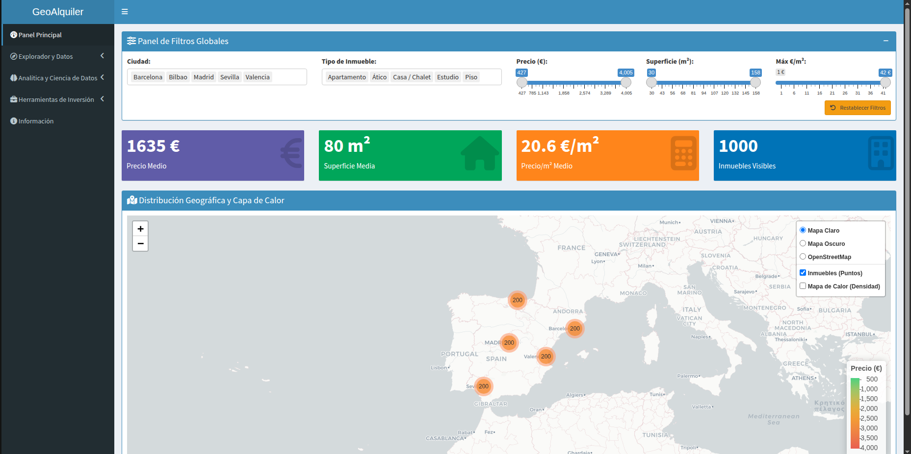 |

| Explorador de Datos | Análisis por Barrios |
|---|---|
| 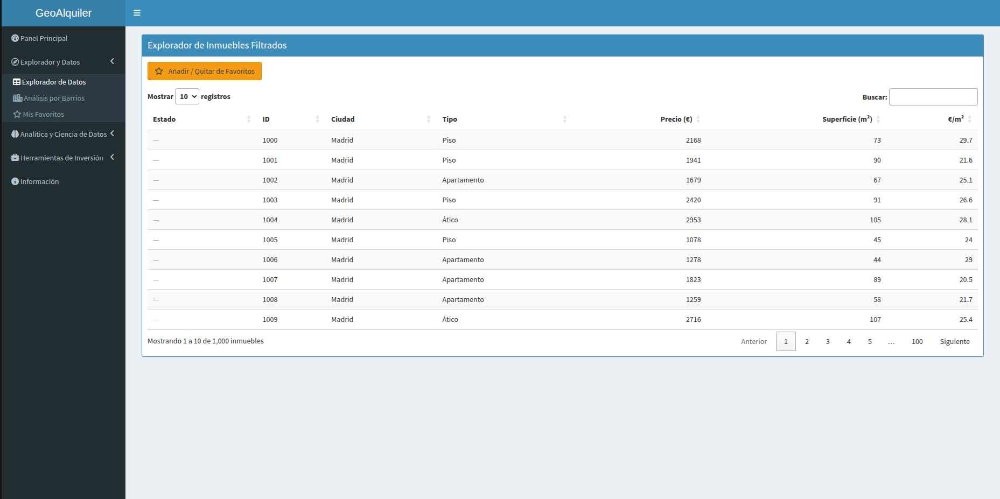 | 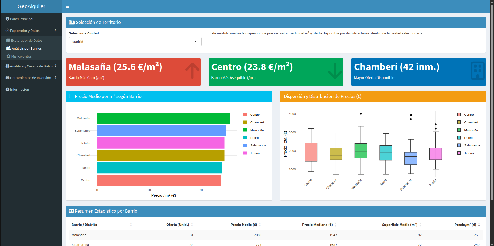 |

### Analítica & Machine Learning

| Analítica Visual | Predicción ML |
|---|---|
| 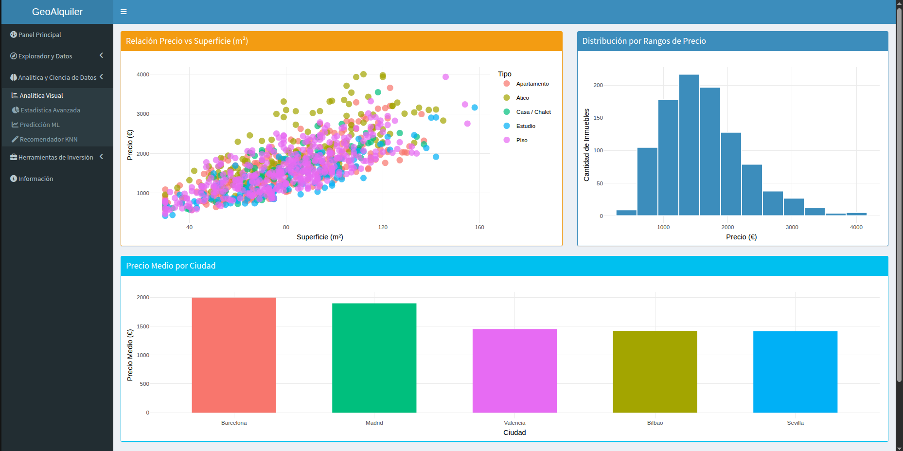 | 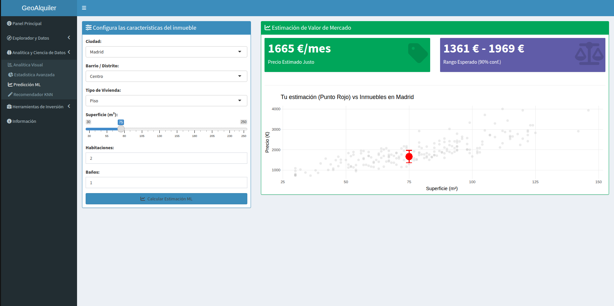 |

| Recomendador KNN | Estadística Avanzada |
|---|---|
| 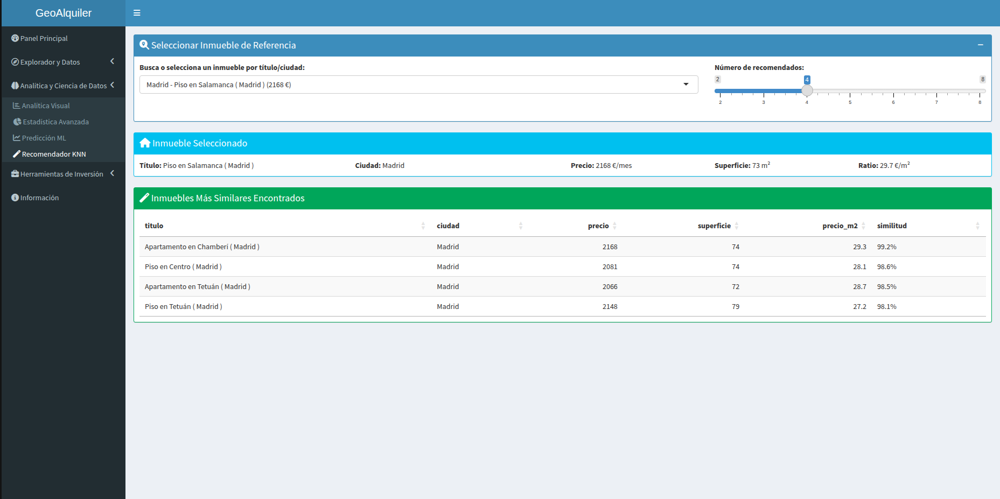 | 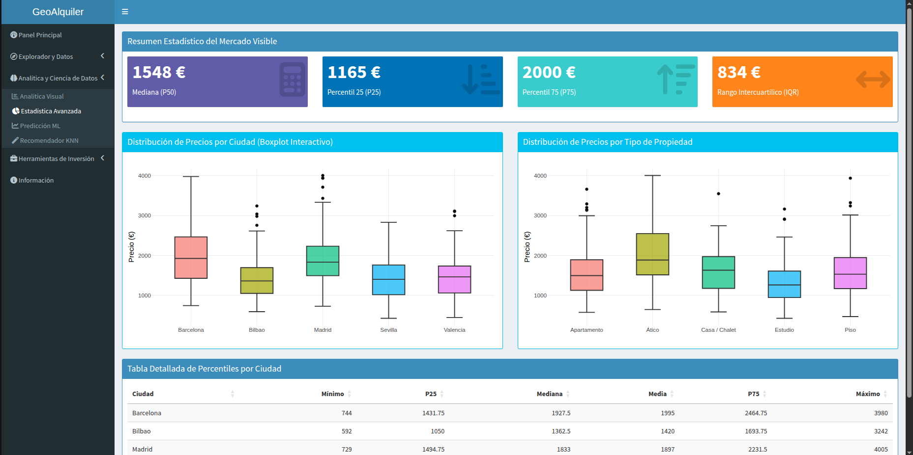 |

### Herramientas de Inversión

| Comparador A/B | Detector de Oportunidades |
|---|---|
| 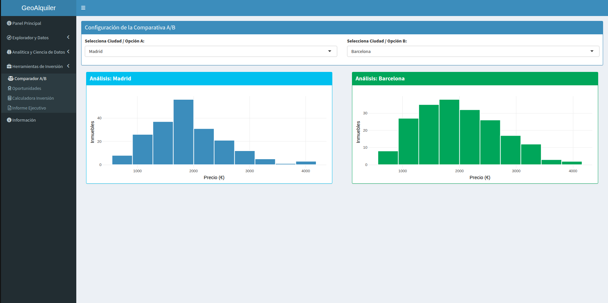 | 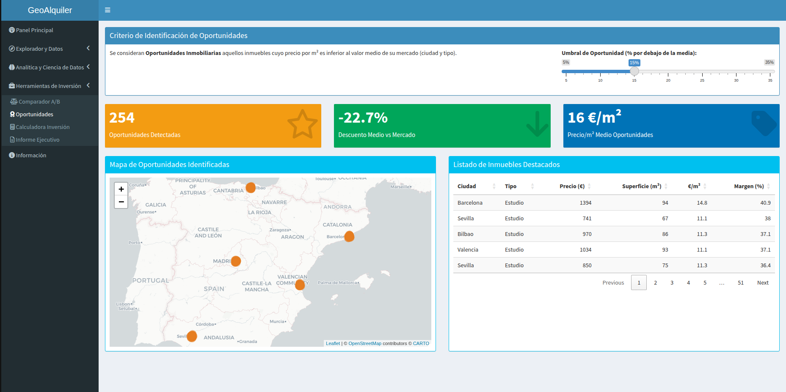 |

| Calculadora de Rentabilidad | Informe Ejecutivo |
|---|---|
| 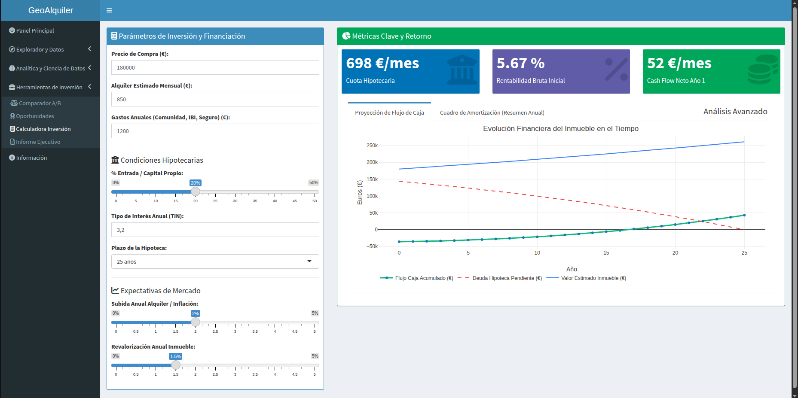 | 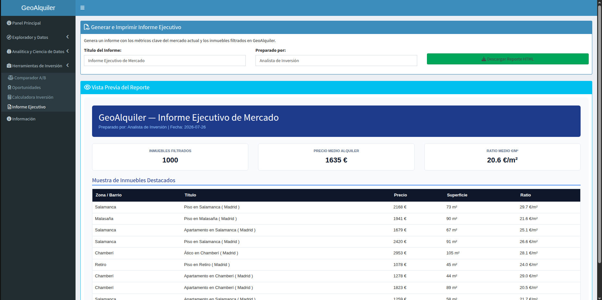 |

---

<a id="estructura-proyecto"></a>
## Estructura del Proyecto (`{golem}`)

GeoAlquiler **no es una simple app de Shiny en un único `app.R`**, sino un **paquete de R** construido con el framework **[`{golem}`](https://thinkr-open.github.io/golem/)**. Este enfoque aporta las ventajas propias de un paquete (documentación con `roxygen2`, gestión formal de dependencias vía `DESCRIPTION`, testing con `testthat`, y un ciclo de vida claro de desarrollo → build → despliegue), aplicadas a una aplicación Shiny de tamaño y complejidad reales.

```
geo-alquiler/
├── DESCRIPTION            # Metadatos del paquete y dependencias (Imports)
├── app.R                  # Lanzador estandarizado (pkgload::load_all + run_app())
├── R/                     # Código fuente del paquete (namespace de la app)
│   ├── run_app.R          # Punto de entrada: shinyApp(ui = app_ui, server = app_server)
│   ├── app_ui.R            # UI global: dashboardPage, sidebarMenu y tabItems
│   ├── app_server.R        # Server global: orquesta la lógica reactiva y llama a cada módulo
│   ├── mod_mapa.R           # Módulo: mapa interactivo + heatmap
│   ├── mod_filtros.R        # Módulo: filtros globales reactivos
│   ├── mod_tabla.R          # Módulo: explorador de datos (DT)
│   ├── mod_barrios.R        # Módulo: analítica por barrios
│   ├── mod_favoritos.R      # Módulo: gestión de favoritos
│   ├── mod_exportar.R       # Módulo: exportación a CSV
│   ├── mod_graficos.R       # Módulo: analítica visual (plotly)
│   ├── mod_estadistica.R    # Módulo: estadística avanzada
│   ├── mod_prediccion.R     # Módulo: predicción de precios (ML)
│   ├── mod_recomendador.R   # Módulo: recomendador KNN
│   ├── mod_comparador.R     # Módulo: comparador A/B
│   ├── mod_oportunidades.R  # Módulo: detector de oportunidades
│   ├── mod_calculadora.R    # Módulo: calculadora de rentabilidad
│   └── mod_reporte.R        # Módulo: informe ejecutivo descargable
├── inst/
│   └── app/
│       └── data/           # Datos empaquetados con la app (p. ej. alquileres.parquet)
├── man/
│   └── figures/            # Capturas de pantalla usadas en este README
├── data/
│   └── processed/          # Datos procesados en formatos .rds / .parquet
├── scripts/
│   └── ingesta/                    # Pipeline de ingesta de datos reales (sustituye a los
│       ├── 00_config.R             # generadores de datos ficticios que había antes)
│       ├── 01_utils.R               # Descarga con caché + geocodificación (Nominatim)
│       ├── 02_fuente_barcelona.R    # Fuente real: Generalitat de Catalunya (INCASÒL)
│       ├── 03_fuente_valencia.R     # Fuente real: Generalitat Valenciana (fianzas)
│       ├── 04_fuente_bilbao.R       # Fuente real: Etxebide / Gobierno Vasco (Informe EMAL)
│       ├── 05_anclas_manuales.R     # Precios documentados a mano donde no hay fuente oficial
│       ├── 06_geocodificar_zonas.R  # Lat/lon reales por zona
│       ├── 07_armonizar_precios.R   # Combina todas las fuentes en una tabla única
│       ├── 08_generar_anuncios.R    # Genera los inmuebles individuales que usa la app
│       └── run_pipeline.R           # Orquestador: Rscript scripts/ingesta/run_pipeline.R
├── data/raw/
│   └── anclas_manuales.csv        # Precios documentados a mano (ciudades sin fuente oficial)
├── reporte_plantilla.Rmd          # Plantilla R Markdown usada por el módulo de Informe Ejecutivo
├── tests/
│   ├── testthat.R                 # Runner estándar de testthat para el paquete
│   └── testthat/
│       ├── test_calculos.R        # Tests de lógica de cálculo (precio/m², KPIs, etc.)
│       ├── test_mod_tabla.R       # Tests del módulo de tabla
│       └── test_tabla.R           # Tests adicionales de tabla/datos
├── renv.lock                      # Lockfile de renv (reproducibilidad de dependencias)
└── geo-alquiler.Rproj             # Proyecto de RStudio
```

### Filosofía de arquitectura

- **Separación UI/Server por módulo**: cada funcionalidad (mapa, predicción, calculadora, etc.) vive en su propio archivo `mod_*.R`, siguiendo el patrón de [Shiny Modules](https://shiny.posit.co/r/articles/improve/modules/) (`NS(id)`, función `*UI()` y función `*Server()`). Esto evita colisiones de `inputId`/`outputId` y permite que `app_ui.R` y `app_server.R` actúen como **orquestadores** en lugar de contener lógica de negocio.
- **`app_ui.R`** define exclusivamente la estructura visual: el `dashboardPage` (`{shinydashboard}`), el menú de navegación con sus cuatro bloques (Exploración, Analítica, Inversión, Información) y el `tabItems` que enlaza cada pestaña con la `UI` de su módulo correspondiente.
- **`app_server.R`** es responsable de instanciar el `server` de cada módulo, pasar el estado reactivo compartido (por ejemplo, los datos ya filtrados por `mod_filtros`) y coordinar la comunicación entre módulos cuando es necesaria (p. ej. favoritos disponibles en la tabla).
- **`run_app.R`** expone la función `run_app()`, que envuelve la `shinyApp` con `golem::with_golem_options()`, permitiendo pasar opciones de configuración (`golem_opts`) sin tocar el resto del código — el patrón estándar de cualquier app basada en `{golem}`.
- **`app.R`** en la raíz es el lanzador "universal": hace `pkgload::load_all()` para cargar el paquete en modo desarrollo y activa `golem.app.prod = TRUE`, lo que lo hace compatible tanto con `shiny::runApp()` local como con servidores de despliegue (Shiny Server, Posit Connect, shinyapps.io, contenedores Docker, etc.) sin necesidad de instalar el paquete previamente.
- **Datos como recurso empaquetado**: el dataset vive en `inst/app/data/`, lo que garantiza que viaje junto con el paquete y esté disponible tanto en desarrollo como una vez instalado/desplegado, siguiendo la convención de `{golem}` para assets de la aplicación.
- **Gestión de dependencias reproducible**: el proyecto usa `{renv}` (`renv.lock` + `.Rprofile`) para fijar versiones exactas de todos los paquetes, asegurando que el entorno de desarrollo y el de despliegue sean idénticos.

[⬆ Volver arriba](#top)

---

<a id="requisitos-instalacion"></a>
## Requisitos e Instalación

### Requisitos previos

- **R** ≥ 4.1 (recomendado 4.3 o superior)
- **RStudio** (recomendado, aunque no imprescindible, desarrollado en Visual Studio Code)
- Sistema operativo: Windows, macOS o Linux
- Conexión a internet para la instalación inicial de dependencias vía `{renv}`

### Dependencias principales (`Imports` en `DESCRIPTION`)

| Paquete | Uso en el proyecto |
|---|---|
| [`golem`](https://cran.r-project.org/package=golem) | Framework de estructuración de la app como paquete de R |
| [`shiny`](https://cran.r-project.org/package=shiny) | Motor reactivo y framework web de la aplicación |
| [`shinydashboard`](https://cran.r-project.org/package=shinydashboard) | Layout de dashboard (sidebar, boxes, valueBoxes) |
| [`arrow`](https://cran.r-project.org/package=arrow) | Lectura/escritura eficiente de datos en formato Parquet |
| [`leaflet`](https://cran.r-project.org/package=leaflet) / [`leaflet.extras`](https://cran.r-project.org/package=leaflet.extras) | Mapa interactivo y capa de calor (heatmap) |
| [`DT`](https://cran.r-project.org/package=DT) | Tablas de datos interactivas |
| [`plotly`](https://cran.r-project.org/package=plotly) | Gráficos interactivos de analítica visual |

A esto se suma `{testthat}` como dependencia de desarrollo para la suite de tests, y `{renv}` para el control de versiones de todas las dependencias. Además, necesitas `{roxygen2}` instalado para generar el archivo `NAMESPACE` del paquete (ver paso 4 de la instalación) — sin él, la aplicación **no arranca correctamente**, ya que `NAMESPACE` es lo que le indica a R qué funciones de `shiny`, `leaflet`, `DT`, etc. debe poner a disposición del código de la app.

### Instalación paso a paso

1. **Clonar el repositorio**

   ```bash
   git clone https://github.com/pdawgabriel-hub/geo-alquiler.git
   cd geo-alquiler
   ```

2. **Abrir el proyecto en RStudio**

   Abre el archivo `geo-alquiler.Rproj`. Esto configurará automáticamente el directorio de trabajo y activará `{renv}` gracias al `.Rprofile` del proyecto (`source("renv/activate.R")`).

3. **Restaurar el entorno de dependencias con `{renv}`**

   Al abrir el proyecto, `{renv}` detectará el `renv.lock` y te propondrá restaurar el entorno. Si no ocurre automáticamente, ejecútalo manualmente desde la consola de R:

   ```r
   install.packages("renv")   # si aún no lo tienes instalado
   renv::restore()
   ```

   Esto instalará exactamente las mismas versiones de todos los paquetes (incluyendo `golem`, `shiny`, `leaflet`, `plotly`, etc.) que se usaron durante el desarrollo del proyecto.

4. **Generar el `NAMESPACE` del paquete con `{roxygen2}`**

   Este paso es **obligatorio** la primera vez que clonas el proyecto (el archivo `NAMESPACE` no viaja generado en el repositorio, sino que se construye a partir de los comentarios `#' @import`/`#' @importFrom` de la carpeta `R/`):

   ```r
   install.packages("roxygen2")   # si aún no lo tienes instalado
   roxygen2::roxygenise()
   ```

   Si te saltas este paso, `pkgload::load_all()` no sabrá qué funciones de `shiny`, `shinydashboard`, `leaflet`, `leaflet.extras`, `DT` y `plotly` debe poner a disposición del código de los módulos, y la app fallará con errores de tipo *"could not find function..."*.

5. **Verificar que el paquete carga correctamente**

   ```r
   pkgload::load_all()
   ```

   Si no aparece ningún error (los avisos/`Warning` en amarillo son normales), el paquete está listo para ejecutarse.

[⬆ Volver arriba](#top)

---

<a id="uso-ejecucion"></a>
## Uso y Ejecución

Al tratarse de un paquete `{golem}`, la aplicación **no se lanza como un script Shiny convencional**, sino a través de la función exportada `run_app()`.

### Opción 1 — Desde la consola de R (modo desarrollo)

```r
# Carga el paquete en memoria sin necesidad de instalarlo
pkgload::load_all()

# Lanza la aplicación
run_app()
```

### Opción 2 — Ejecutando directamente `app.R`

El archivo `app.R` de la raíz del proyecto ya encapsula ambos pasos anteriores y activa las opciones de producción de `{golem}`. Puedes lanzarlo:

- Desde RStudio, con el botón **Run App** al abrir `app.R`.
- Desde la terminal:

  ```bash
  Rscript app.R
  ```

### Opción 3 — Como paquete instalado

```r
# Instalar el paquete localmente
devtools::install()

# Cargarlo y ejecutarlo como cualquier otra librería
library(GeoAlquiler)
run_app()
```

Por defecto, la aplicación se abrirá en el navegador (o en el visor de RStudio) en `http://127.0.0.1:<puerto>`, mostrando el **Panel Principal** con los KPIs globales y el mapa de calor como punto de entrada.

[⬆ Volver arriba](#top)

---

<a id="uso-terminal"></a>
## Uso desde la Terminal (sin RStudio)

Todo lo anterior puede hacerse íntegramente desde una terminal Bash, sin abrir RStudio en ningún momento — útil para servidores, contenedores, CI/CD o si simplemente prefieres la línea de comandos. La clave es usar `Rscript` (el intérprete de R en modo no interactivo) en vez de pegar código en la consola de RStudio.

### 1. Clonar el repositorio

```bash
git clone <URL-del-repositorio>
cd geo-alquiler
```

### 2. Instalar/restaurar dependencias con `{renv}`

```bash
Rscript -e 'install.packages("renv", repos = "https://cloud.r-project.org")'
Rscript -e 'renv::restore()'
```

`renv::restore()` lee el `.Rprofile` y el `renv.lock` igual que si hubieras abierto el `.Rproj` en RStudio, así que instala exactamente las mismas versiones de los paquetes.

### 3. Generar el `NAMESPACE` del paquete con `{roxygen2}`

Paso obligatorio, igual que en RStudio: el `NAMESPACE` no viene generado en el repositorio, y sin él `pkgload::load_all()` no podrá poner a disposición del código las funciones de `shiny`, `leaflet`, `DT`, `plotly`, etc.

```bash
Rscript -e 'install.packages("roxygen2", repos = "https://cloud.r-project.org")'
Rscript -e 'roxygen2::roxygenise()'
```

### 4. Verificar que el paquete carga correctamente

```bash
Rscript -e 'pkgload::load_all()'
```

### 5. Ejecutar la aplicación

Cualquiera de estas tres opciones es equivalente a pulsar "Run App" en RStudio:

```bash
# Opción A: usando el lanzador de la raíz del proyecto
Rscript app.R

# Opción B: cargando el paquete en modo desarrollo y llamando a run_app()
Rscript -e 'pkgload::load_all(); run_app()'

# Opción C: si ya lo has instalado como paquete (devtools::install())
Rscript -e 'library(GeoAlquiler); run_app()'
```

> Por defecto, `run_app()` intentará abrir un navegador automáticamente, algo que no existe en un servidor sin entorno gráfico. Si ejecutas esto en remoto (una VM, un contenedor, etc.), añade `options(shiny.launch.browser = FALSE)` antes de llamar a `run_app()`, y opcionalmente fija un puerto y host fijos:
>
> ```bash
> Rscript -e 'pkgload::load_all(); options(shiny.launch.browser = FALSE); shiny::runApp(shiny::shinyApp(ui = app_ui, server = app_server), host = "0.0.0.0", port = 3838)'
> ```
>
> Así la app queda escuchando en `http://<IP-del-servidor>:3838` y puedes acceder desde cualquier navegador sin depender del entorno gráfico de la máquina donde corre.

### 6. Ejecutar los tests

```bash
Rscript -e 'testthat::test_dir("tests/testthat")'
```

o, si tienes `{devtools}` instalado (es una dependencia pesada, no obligatoria para el día a día):

```bash
Rscript -e 'devtools::test()'
```

### 7. Comprobación completa del paquete (`R CMD check`)

Sin necesidad de `{devtools}`, usando directamente las herramientas de línea de comandos de R (además, es el equivalente que se usaría en un pipeline de CI):

```bash
R CMD build .
R CMD check --no-manual GeoAlquiler_*.tar.gz
```

### Resumen — equivalencias RStudio ↔ Terminal

| Acción | En RStudio | En Bash |
|---|---|---|
| Restaurar dependencias | Se ofrece al abrir el `.Rproj` | `Rscript -e 'renv::restore()'` |
| Generar `NAMESPACE` | `Ctrl/Cmd + Shift + D` (o al hacer *Build*) | `Rscript -e 'roxygen2::roxygenise()'` |
| Cargar el paquete | `Ctrl/Cmd + Shift + L` | `Rscript -e 'pkgload::load_all()'` |
| Lanzar la app | Botón "Run App" | `Rscript app.R` |
| Ejecutar tests | `Ctrl/Cmd + Shift + T` | `Rscript -e 'testthat::test_dir("tests/testthat")'` |
| Check completo del paquete | `Ctrl/Cmd + Shift + E` | `R CMD build . && R CMD check --no-manual *.tar.gz` |

[⬆ Volver arriba](#top)

---

<a id="testing-calidad"></a>
## Testing & Calidad

GeoAlquiler incluye una suite de **pruebas unitarias** con **[`{testthat}`](https://testthat.r-lib.org/)**, siguiendo la estructura estándar de un paquete de R (`tests/testthat/`). Las pruebas actuales cubren, entre otros aspectos, la lógica de cálculo de métricas (p. ej. precio por m²) y el comportamiento seguro de los KPIs ante conjuntos de datos vacíos, así como el módulo de tabla.

### Ejecutar todos los tests

Desde la consola de R, en la raíz del proyecto:

```r
testthat::test_dir("tests/testthat")
```

o, si tienes `{devtools}` instalado:

```r
devtools::test()
```

### Ejecutar un archivo de test concreto

```r
testthat::test_file("tests/testthat/test_calculos.R")
```

### Comprobación completa del paquete (build check)

Para una validación más exhaustiva —similar a la que se ejecutaría antes de un release o de subir el paquete a un repositorio—, se recomienda:

```r
devtools::check()
```

Este comando verifica, además de los tests, la consistencia del `DESCRIPTION`, la documentación `roxygen2` y la estructura general del paquete.

> **Buenas prácticas seguidas en el proyecto:** cada nueva funcionalidad de cálculo (predicción de precios, rentabilidad, detección de oportunidades) debería idealmente acompañarse de su correspondiente test en `tests/testthat/`, manteniendo el patrón `test_that("descripción del comportamiento", { expect_*(...) })` ya presente en `test_calculos.R`.

[⬆ Volver arriba](#top)

---

<a id="despliegue"></a>
## Despliegue

Al estar construido como paquete `{golem}` con un lanzador (`app.R`) desacoplado del entorno de desarrollo, GeoAlquiler está preparado para desplegarse en varios entornos habituales del ecosistema Shiny.

En desarrollo.....

Se recomienda:

1. Asegurar que `renv.lock` está actualizado (`renv::snapshot()`) antes de desplegar, para garantizar reproducibilidad exacta de versiones en el servidor de destino.
2. Verificar que los datos necesarios (`inst/app/data/alquileres.parquet`) están incluidos en el despliegue, ya que la app depende de ellos para funcionar.
3. Revisar que `options("golem.app.prod" = TRUE)` esté activo en producción (ya configurado en `app.R`), lo que desactiva ciertas ayudas de desarrollo y optimiza el arranque.

[⬆ Volver arriba](#top)

---

<a id="licencia"></a>
## Licencia

Este proyecto se publica como **pieza de portfolio personal** y tiene una licencia de uso restringido. En detalle:

- ✅ Puedes **ver, clonar y ejecutar** el código con fines de **aprendizaje, evaluación técnica o revisión de portfolio** (por ejemplo, como parte de un proceso de selección o para estudiar la arquitectura del proyecto).
- ✅ Puedes **modificar el código para uso personal, no comercial**, siempre citando la autoría original.
- ❌ **No está permitido el uso comercial** del proyecto, ni total ni parcial (incluyendo su despliegue como producto o servicio, su reventa, o su integración en soluciones comerciales de terceros) sin autorización expresa del autor.
- 👤 **El único titular con derecho a explotación comercial del proyecto es el autor original**, [Gabriel](https://github.com/pdawgabriel-hub) (autor y desarrollador de GeoAlquiler).

El texto legal completo se encuentra en el archivo [`LICENSE.md`](./LICENSE.md) (versión en inglés: [`LICENSE.en.md`](./LICENSE.en.md)).

[⬆ Volver arriba](#top)

---

<a id="autor"></a>
## Autor

Desarrollado por **Gabriel Iborra Vicente** como proyecto de portfolio, con el objetivo de demostrar el desarrollo de aplicaciones Shiny de nivel profesional estructuradas como paquete de R (`{golem}`), combinando analítica geoespacial, modelos de Machine Learning y herramientas de decisión de inversión inmobiliaria.

[⬆ Volver arriba](#top)