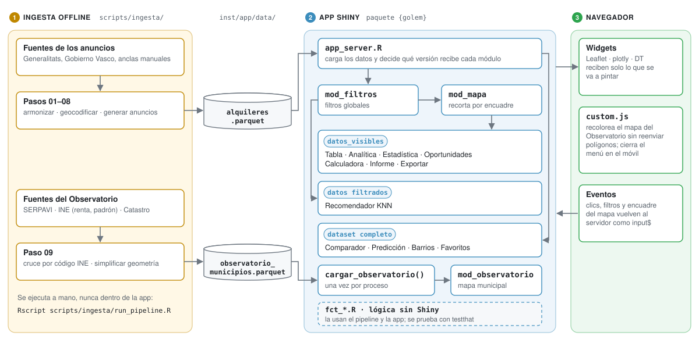

<a id="top"></a>
# Guía técnica de GeoAlquiler

Esta guía explica el código en detalle: cómo está organizado, cómo fluyen los datos, cómo se generan y cómo se ejecuta, prueba y despliega la app. Para una visión general del proyecto, empieza por el [README](../README.md).

## Índice

- [1. Arquitectura](#arquitectura)
- [2. Estructura del proyecto](#estructura)
- [3. Flujo de datos dentro de la app](#flujo-datos)
- [4. Pipeline de datos](#pipeline)
  - [4.1 Dataset de anuncios](#pipeline-anuncios)
  - [4.2 Observatorio del Alquiler](#pipeline-observatorio)
- [5. Rendimiento](#rendimiento)
- [6. Instalación y ejecución](#instalacion)
- [7. Tests](#tests)
- [8. Despliegue](#despliegue)
- [9. Dónde tocar para…](#donde-tocar)

---

<a id="arquitectura"></a>
## 1. Arquitectura



La app se organiza en tres capas que no se mezclan:

1. **Ingesta offline** (`scripts/ingesta/`): descarga, limpia y cruza las fuentes. Se ejecuta a mano y produce dos ficheros Parquet que viajan con el paquete. La app nunca descarga nada en tiempo de ejecución.
2. **Lógica de negocio sin Shiny** (`R/fct_*.R`): funciones puras, sin `input`, `output` ni reactividad, que usan tanto el pipeline como la app y se prueban directamente con `testthat`.
3. **Interfaz reactiva por módulos** (`R/mod_*.R`): cada pantalla es un módulo; `app_ui.R` y `app_server.R` solo los ensamblan.

[⬆ Volver arriba](#top)

---

<a id="estructura"></a>
## 2. Estructura del proyecto

GeoAlquiler no es una app de Shiny en un único `app.R`, sino un **paquete de R** construido con [`{golem}`](https://thinkr-open.github.io/golem/). Eso aporta lo propio de un paquete: dependencias declaradas en `DESCRIPTION`, documentación con `roxygen2`, tests con `testthat` y un ciclo claro de desarrollo → build → despliegue.

```
geo-alquiler/
├── DESCRIPTION            # Metadatos del paquete y dependencias (Imports / Suggests)
├── NAMESPACE              # Generado por roxygen2 a partir de las etiquetas @import (versionado)
├── app.R                  # Lanzador: pkgload::load_all() + run_app()
├── R/
│   ├── run_app.R          # Punto de entrada: shinyApp(ui = app_ui, server = app_server)
│   ├── app_ui.R           # UI global: dashboardPage, menú lateral y tabItems
│   ├── app_server.R       # Server global: carga los datos y llama a cada módulo
│   ├── mod_mapa.R         # Mapa del Panel Principal + heatmap; devuelve los datos del encuadre
│   ├── mod_filtros.R      # Filtros globales
│   ├── mod_tabla.R        # Explorador de datos (DT)
│   ├── mod_barrios.R      # Analítica por barrios
│   ├── mod_favoritos.R    # Favoritos de la sesión
│   ├── mod_exportar.R     # Exportación a CSV
│   ├── mod_graficos.R     # Analítica visual (plotly)
│   ├── mod_estadistica.R  # Estadística avanzada
│   ├── mod_prediccion.R   # Predicción de precios (regresión)
│   ├── mod_recomendador.R # Recomendador KNN
│   ├── mod_comparador.R   # Comparador A/B
│   ├── mod_oportunidades.R# Detector de oportunidades
│   ├── mod_calculadora.R  # Calculadora de rentabilidad
│   ├── mod_reporte.R      # Informe ejecutivo descargable
│   ├── mod_observatorio.R # Observatorio del Alquiler (mapa coroplético municipal)
│   └── fct_observatorio.R # Lógica del observatorio sin Shiny: indicadores, formato,
│                          #   motivos de "sin dato", WKB -> sf, JSON de geometría, caché
├── inst/app/
│   ├── data/              # alquileres.parquet y observatorio_municipios.parquet
│   └── www/               # custom.css y custom.js (ver "Rendimiento")
├── scripts/
│   ├── deploy.R           # Despliegue a shinyapps.io (lista de ficheros a subir)
│   └── ingesta/
│       ├── 00_config.R            # Ciudades, rutas, año de referencia del observatorio
│       ├── 01_utils.R             # Descarga con caché + geocodificación (Nominatim)
│       ├── 02_fuente_barcelona.R  # Generalitat de Catalunya (INCASÒL)
│       ├── 03_fuente_valencia.R   # Generalitat Valenciana (fianzas)
│       ├── 04_fuente_bilbao.R     # Etxebide / Gobierno Vasco (Informe EMAL)
│       ├── 05_anclas_manuales.R   # Precios documentados a mano donde no hay fuente oficial
│       ├── 06_geocodificar_zonas.R# Lat/lon reales por zona
│       ├── 07_armonizar_precios.R # Combina todas las fuentes en una tabla única
│       ├── 08_generar_anuncios.R  # Genera los inmuebles que usa la app
│       ├── 09_observatorio.R      # SERPAVI + INE (renta, padrón) + Catastro por municipio
│       └── run_pipeline.R         # Orquestador
├── data/
│   ├── raw/               # Cachés de descarga (no versionadas) + anclas_manuales.csv (versionado)
│   └── processed/         # Copia de los Parquet generados
├── man/figures/           # Capturas y esquema de arquitectura de la documentación
├── docs/                  # Esta guía
├── reporte_plantilla.Rmd  # Plantilla del Informe Ejecutivo
├── tests/testthat/        # Tests (ver sección 7)
└── renv.lock              # Versiones exactas de todas las dependencias
```

### Convenciones

- **Módulos**: cada pantalla vive en su `mod_*.R` con el patrón de [Shiny Modules](https://shiny.posit.co/r/articles/improve/modules/) (`NS(id)`, `*UI()` y `*Server()`). Así no colisionan los `inputId`/`outputId` y `app_ui.R`/`app_server.R` solo orquestan.
- **Lógica sin Shiny** en `fct_*.R`: si una función no necesita reactividad, va ahí y se testea sin servidor.
- **`app_ui.R`** define solo la estructura visual: el `dashboardPage`, el menú lateral (Panel Principal, Observatorio, Exploración, Analítica, Inversión e Información) y los `tabItems` que enlazan cada pestaña con la UI de su módulo.
- **`run_app.R`** envuelve la `shinyApp` con `golem::with_golem_options()`, de modo que se pueden pasar opciones (`golem_opts`) sin tocar el resto del código.
- **`app.R`** es el lanzador universal: hace `pkgload::load_all()` y activa `golem.app.prod = TRUE`, así que funciona igual en local que en Shiny Server, Posit Connect, shinyapps.io o un contenedor, sin instalar el paquete.
- **Datos empaquetados** en `inst/app/data/`, siguiendo la convención de `{golem}`: viajan con el paquete y están disponibles tanto en desarrollo como desplegado.
- **Dependencias reproducibles** con `{renv}` (`renv.lock` + `.Rprofile`).

[⬆ Volver arriba](#top)

---

<a id="flujo-datos"></a>
## 3. Flujo de datos dentro de la app

`app_server.R` carga los dos ficheros Parquet y decide qué versión de los datos recibe cada módulo. Es la decisión de diseño central de la app:

```
alquileres.parquet ──► datos_totales ──► mod_filtros ──► datos filtrados ──► mod_mapa ──► datos_visibles
                            │                                  │                              │
                            │                                  └─► Recomendador KNN           └─► Tabla, Analítica, Estadística,
                            └─► Comparador, Predicción,                                           Oportunidades, Calculadora,
                                Barrios, Favoritos                                                Informe, Exportar

observatorio_municipios.parquet ──► cargar_observatorio() (una vez por proceso) ──► mod_observatorio
```

| El módulo recibe… | Módulos | Por qué |
|---|---|---|
| `datos_visibles`: filtros + lo que se ve en el mapa del Panel Principal | Tabla, Analítica, Estadística, Oportunidades, Calculadora, Informe, Exportar | Responden a "lo que estoy mirando ahora" |
| Datos filtrados, sin recorte del mapa | Recomendador KNN | Buscar similares solo en el encuadre daría muy pocos candidatos |
| Dataset completo (`datos_totales`) | Comparador, Predicción, Barrios, Favoritos | Necesitan todo el mercado: entrenar el modelo, comparar ciudades, no perder favoritos al filtrar |
| Su propio dataset | Observatorio | Datos oficiales agregados por municipio, independientes de los filtros |

Detalles que conviene conocer:

- **`mod_mapa` devuelve los datos del encuadre visible.** Filtra por `input$mapa_alquiler_bounds`. Un redimensionado del mapa (rotar el móvil, abrir el menú) puede hacer que Leaflet informe un momento de un encuadre inválido; en ese caso se devuelven todos los datos en vez de vaciar las siete pantallas que dependen de `datos_visibles`.
- **Favoritos** se guardan en un `reactiveVal` (`favoritos_ids`) creado en `app_server.R` y compartido entre `mod_tabla` (donde se marcan) y `mod_favoritos` (donde se gestionan). Viven solo durante la sesión.
- **El Observatorio no depende de los filtros globales.** Tiene sus propios controles (indicador, ámbito, población mínima) y su propio estado de municipio seleccionado, que sincroniza mapa, ficha, gráfico y ranking.

[⬆ Volver arriba](#top)

---

<a id="pipeline"></a>
## 4. Pipeline de datos

Todo se regenera con:

```bash
Rscript scripts/ingesta/run_pipeline.R                       # anuncios + observatorio
Rscript scripts/ingesta/run_pipeline.R --solo-observatorio   # solo el observatorio
```

Las descargas se cachean en `data/raw/` para no repetir peticiones si ya son recientes. Si una fuente cambia de formato o de URL, el paso correspondiente se detiene con un error explícito que indica qué ha encontrado, en vez de guardar datos mal interpretados en silencio. Un fallo del observatorio dentro del pipeline completo no invalida el dataset de anuncios ya guardado.

Solo para regenerar datos hacen falta, además de las dependencias de la app:

| Dependencia | Uso |
|---|---|
| `{httr}` | Descarga de las fuentes (Suggests en `DESCRIPTION`) |
| `{readxl}` | Lectura del Excel de Barcelona (Suggests) |
| `{jsonlite}` | Geocodificación vía Nominatim (ya en Imports) |
| `{sf}` | Lectura y simplificación del shapefile de SERPAVI (ya en Imports) |
| `pdftotext` (paquete de sistema `poppler-utils`) | Texto del informe trimestral de Bilbao. En Linux: `sudo apt install poppler-utils` |

<a id="pipeline-anuncios"></a>
### 4.1 Dataset de anuncios (`alquileres.parquet`)

Pasos 01 a 08: configuración → utilidades → una fuente por ciudad → anclas manuales → geocodificación → armonización → generación. Para añadir una ciudad basta con tocar `00_config.R` y, si no hay fuente oficial, `data/raw/anclas_manuales.csv`.

| Ciudad | Fuente | Detalle | Fiabilidad |
|---|---|---|---|
| **Barcelona** | Generalitat de Catalunya (INCASÒL), fianzas de alquiler depositadas | Por barrio (73 barrios) | Oficial |
| **Bilbao** | Gobierno Vasco (Etxebide), Informe EMAL trimestral | Por barrio (€/m² ya calculado por la fuente) | Oficial |
| **Valencia** | Generalitat Valenciana, registro de fianzas | Por código postal (barrio resuelto por geocodificación inversa) | Oficial |
| **Madrid, Sevilla** | Sin fuente pública con importe y geografía (verificado) | Municipio + algunos barrios conocidos | Ancla manual en `data/raw/anclas_manuales.csv` |

En Madrid y Sevilla no existe ningún registro público, ni estatal ni autonómico, de fianzas con importe y desglose geográfico; se comprobó expresamente. Para esos casos se usa un **ancla manual**: un precio/m² documentado a mano a partir de un índice publicado (idealista/fotocasa), con fecha, URL y nota de fiabilidad. Esas filas quedan marcadas como estimadas.

La geocodificación usa [Nominatim/OpenStreetMap](https://nominatim.openstreetmap.org/) respetando su política de uso (1 petición por segundo, User-Agent identificable) y se cachea en `data/raw/geocache_zonas.csv`.

Esquema del dataset final:

| Columna | Tipo | Descripción |
|---|---|---|
| `id` | texto | Identificador único del inmueble |
| `titulo` | texto | Título generado (tipo + zona + ciudad) |
| `ciudad` | texto | Municipio |
| `barrio` | texto | Barrio/distrito/código postal resuelto (o el municipio si no hay desglose) |
| `tipo` | texto | Piso, Apartamento, Ático, Estudio o Casa / Chalet |
| `precio` | numérico | Alquiler mensual estimado (€), derivado del €/m² real de la zona |
| `superficie` | numérico | Superficie (m²) |
| `habitaciones` / `banos` | numérico | Nº de habitaciones / baños |
| `lat` / `lon` / `lng` | numérico | Coordenadas reales de la zona (no aleatorias) |
| `fuente_dato` | texto | Fuente del €/m² de esa zona |
| `es_estimado` | lógico | `TRUE` si la zona no tiene fuente oficial (ancla manual) |
| `nivel_geo` | texto | Granularidad real del dato: `barrio`, `municipio`, `zona_sin_fuente_oficial`… |

Los "anuncios" individuales son una ilustración generada dentro de cada zona (superficie, tipología y un margen de ruido aleatorio con semilla fija), pero el precio de cada uno **siempre parte del €/m² real de su zona**.

<a id="pipeline-observatorio"></a>
### 4.2 Observatorio del Alquiler (`observatorio_municipios.parquet`)

Lo genera `09_observatorio.R`: una fila por municipio (~4,8 MB) con los indicadores y la geometría en WKB a dos niveles de detalle. Todas las fuentes se refieren al mismo año, `ANIO_OBSERVATORIO` en `00_config.R` (2022), para que los ratios entre ellas comparen el mismo ejercicio. Las descargas se cachean en `data/raw/observatorio/` (no versionado, ~100 MB).

| Fuente | Qué se descarga | Cómo |
|---|---|---|
| **SERPAVI** (Ministerio de Vivienda y Agenda Urbana) | Medianas de alquiler (€/m², €/mes, superficie, nº de viviendas) y geometría municipal (IGN) | La web de SERPAVI es una calculadora con reCAPTCHA, pero el CDN del Ministerio publica la capa completa como shapefile (`ALQ_Municipios_2022_Web.zip`, ~43 MB) |
| **INE, ADRH** | Renta neta media por hogar y por persona | Tabla nacional 30824 (~350 MB sin comprimir, con todas las secciones censales): se descarga comprimida y se filtra en streaming a las filas de municipio del año de referencia |
| **INE, Padrón** | Población por municipio | Tabla 29005 (cifras oficiales de todos los municipios y años) |
| **Catastro** | Nº de inmuebles y valor catastral de uso residencial | Tablas JAXI por provincia (`URAO`/`URBO`). No hay descarga directa del `.px`: se reproduce el envío del formulario "Consultar todo" y se parsea la tabla HTML |

**Mediana de alquiler.** Se usa la de vivienda colectiva (pisos). SERPAVI solo la publica si hay suficientes contratos de pisos; en 749 municipios (p. ej. Torrent) solo hay mediana de unifamiliares, y en ese caso se usa esa y la columna `tipo_vivienda_alquiler` lo indica para que la ficha lo advierta.

**Cruce del Catastro con el INE.** El Catastro no publica el código INE en sus tablas municipales, así que se cruza por nombre en tres pasos, siempre dentro de cada provincia:

1. **Nombre normalizado** (`claves_municipio()`): sin tildes ni signos, con el artículo delante ("Acebeda (La)", "Acebeda, La" y "La Acebeda" dan la misma clave) y una clave por idioma en los nombres bilingües ("Alicante/Alacant").
2. **Equivalencias manuales** (`EQUIVALENCIAS_CATASTRO`): renombramientos completos que no se pueden deducir con seguridad, como Alfara de Algimia → Alfara de la Baronia.
3. **Nombre aproximado** (`emparejar_aproximado()`), solo con lo que queda sin cruzar: distancia de edición relativa ≤ 0,35, o un nombre contenido en el otro. Los empates ambiguos se descartan y, si en una provincia queda exactamente un nombre y un código libres, se emparejan entre sí. El pipeline imprime los cruces aproximados para poder revisarlos.

Con esto se cruzan los 7.612 nombres del Catastro. Cuatro corresponden a municipios gallegos fusionados en 2013 y 2016 (Oza-Cesuras, Cerdedo-Cotobade) que el Catastro aún lista por separado y no aparecen en el mapa.

**Geometría.** Se simplifica a dos tolerancias sobre EPSG:3857: ~250 m (vista de una provincia) y ~1,5 km (vista de toda España). Se guarda en WKB y `observatorio_a_sf()` la reconstruye en la app.

**Limitaciones conocidas** (la app las explica en la ficha de cada municipio, mediante `motivo_sin_dato()`):

- **País Vasco y Navarra** no aparecen en SERPAVI ni en el Catastro estatal (tienen Hacienda y Catastro forales). Sus municipios solo tienen renta y población; el nombre de provincia se rellena a partir del código INE porque SERPAVI lo deja vacío.
- SERPAVI publica la mediana en 2.966 de 8.131 municipios, que concentran el 90 % de la población. El resto no tiene suficientes contratos declarados.
- El INE no publica la renta de los municipios muy pequeños, por secreto estadístico.
- "Viviendas en alquiler" cuenta **alquileres declarados** a Hacienda: es una cota inferior del peso real del alquiler.
- Los 86 polígonos con código 53xxx/54xxx no son municipios sino territorios compartidos entre varios (parzonerías, comunidades de montes). Se marcan con `es_municipio = FALSE`.

[⬆ Volver arriba](#top)

---

<a id="rendimiento"></a>
## 5. Rendimiento

La app está pensada para cargar rápido también en el móvil y con conexiones lentas. La regla general es hacer el trabajo pesado en el servidor y mandar al navegador solo lo que se va a pintar.

| Optimización | Qué resuelve |
|---|---|
| **Gráficos con `plotly` nativo (no `ggplotly()`)** | Todos los gráficos interactivos se construyen con `plot_ly()`/`add_trace()` en vez de convertir un `ggplot2` con `ggplotly()`, que genera un JSON notablemente más pesado para el mismo gráfico. |
| **Histogramas pre-agregados en el servidor** | Los bins se calculan en R con `hist()` y se envían solo las barras, en vez de cada precio en crudo para que Plotly los agrupe en el navegador. |
| **Submuestreo en gráficos densos** | El scatter de precio/superficie y los boxplots de Estadística Avanzada limitan los puntos que viajan al navegador (muestra aleatoria con un aviso visible) cuando el conjunto filtrado es muy grande. |
| **Mapa agregado por barrio** | La capa por defecto del Panel Principal manda un resumen por barrio (precio medio + nº de inmuebles), no cada inmueble. Los pines individuales y el mapa de calor se cargan bajo demanda (`leafletProxy`) solo si se activa esa capa. |
| **Clustering de marcadores** | El mapa de Oportunidades agrupa sus marcadores (`markerClusterOptions`) para que un umbral poco restrictivo no sature el navegador. |
| **CSS responsive** (`inst/app/www/custom.css`) | Ajusta las alturas de Leaflet/Plotly (fijas en píxeles por defecto), el control de capas y los controles de `DT` a cada ancho de pantalla, con `scrollX` en todas las tablas. |
| **JS mínimo** (`inst/app/www/custom.js`) | Cierra el menú lateral al navegar en pantallas estrechas, y recolorea el mapa del Observatorio (ver abajo). |
| **Mapas base sin clave de API** | OpenStreetMap como capa base por defecto (Positron/DarkMatter de CartoDB exigen ahora API key). |

### Observatorio: cómo carga ~8.200 polígonos

| Técnica | Detalle |
|---|---|
| **Dos niveles de detalle** | La vista nacional usa la geometría simplificada a ~1,5 km (a zoom 5-6 un píxel ya son ~2 km): ~90.000 vértices en vez de ~260.000. Al elegir una provincia se usa la de ~250 m. |
| **Canvas en vez de SVG** | `leafletOptions(preferCanvas = TRUE)`: miles de polígonos en SVG son muy lentos de dibujar. |
| **JSON de geometría generado a mano** | `addPolygons()` + `jsonlite` tarda ~6 s en convertir los polígonos al JSON de Leaflet, porque construye cientos de miles de listas anidadas. `geometria_a_json_leaflet()` genera el mismo JSON directamente desde `st_coordinates()` con operaciones vectorizadas, en ~1,4 s. Se marca con clase `json` para que shiny y htmlwidgets lo inserten sin volver a serializarlo. Un test comprueba que es idéntico al de Leaflet. |
| **Caché por proceso** | `cargar_observatorio()` lee el parquet y lo convierte a `sf` una sola vez por proceso (en shinyapps.io un proceso atiende muchas sesiones), y la geometría serializada se cachea por ámbito dentro de ese objeto. |
| **Los polígonos van con el mapa** | El primer render del mapa ya incluye los polígonos, sin esperar a que el navegador avise de que el mapa existe. Los cambios de ámbito posteriores van por `leafletProxy`: volver a renderizar el widget lo destruiría con un redibujado de canvas pendiente y Leaflet daría un error (`clearRect`). |
| **Recolorear en el navegador** | Cambiar de indicador no cambia la forma de los municipios. Un manejador JS (`observatorio_recolorear` en `custom.js`) busca cada polígono por su código INE y cambia su color y su etiqueta: ~200 KB en vez de reenviar toda la geometría. El resaltado de Leaflet solo restaura el borde en `mouseout`, así que el nuevo relleno se mantiene. |
| **El mapa primero, el resto después** | Shiny envía juntas todas las salidas de un ciclo y no pinta ninguna hasta cargar las librerías de todas; la primera vez eso incluye `plotly.js` (~3,5 MB). El gráfico y el ranking esperan a `input$mapa_pintado`, que el navegador envía (`htmlwidgets::onRender` + dos `requestAnimationFrame`) cuando el mapa ya está en pantalla. |
| **Clics del gráfico sin `event_data()`** | Se lee directamente el input `plotly_click-<source>`: `event_data()` emitía en cada sesión un aviso diferido de "evento no registrado" que no se puede silenciar. |

Resultado medido en local con Chromium: el mapa nacional aparece a ~1,2 s de abrir la pestaña (antes ~3,2 s), y a ~2,6 s la primera vez tras arrancar el servidor (antes ~9,8 s).

[⬆ Volver arriba](#top)

---

<a id="instalacion"></a>
## 6. Instalación y ejecución

### Requisitos

- **R** ≥ 4.1 (recomendado 4.3 o superior).
- RStudio es opcional; todo se puede hacer desde la terminal.
- Conexión a internet para instalar las dependencias la primera vez.

Dependencias principales (`Imports` en `DESCRIPTION`):

| Paquete | Uso |
|---|---|
| [`golem`](https://cran.r-project.org/package=golem) | Estructura de la app como paquete de R |
| [`shiny`](https://cran.r-project.org/package=shiny) / [`shinydashboard`](https://cran.r-project.org/package=shinydashboard) | Motor reactivo y layout del dashboard |
| [`arrow`](https://cran.r-project.org/package=arrow) | Lectura de los ficheros Parquet |
| [`leaflet`](https://cran.r-project.org/package=leaflet) / [`leaflet.extras`](https://cran.r-project.org/package=leaflet.extras) | Mapas y capa de calor |
| [`DT`](https://cran.r-project.org/package=DT) | Tablas interactivas |
| [`plotly`](https://cran.r-project.org/package=plotly) | Gráficos interactivos |
| [`sf`](https://cran.r-project.org/package=sf) | Geometría municipal del Observatorio |
| [`htmlwidgets`](https://cran.r-project.org/package=htmlwidgets) | Aviso del navegador cuando el mapa del Observatorio ya está pintado (`onRender`) |
| [`jsonlite`](https://cran.r-project.org/package=jsonlite) | Lectura de los clics del gráfico del Observatorio |

### Puesta en marcha

```bash
git clone https://github.com/pdawgabriel-hub/geo-alquiler.git
cd geo-alquiler
Rscript -e 'install.packages("renv", repos = "https://cloud.r-project.org")'   # si no tienes renv
Rscript -e 'renv::restore()'      # instala las versiones exactas de renv.lock
Rscript app.R                     # lanza la app
```

Desde RStudio es lo mismo: abre `geo-alquiler.Rproj` (activa `renv` mediante `.Rprofile`), acepta restaurar el entorno y pulsa **Run App** sobre `app.R`.

La app abre el navegador en `http://127.0.0.1:<puerto>` con el Panel Principal. No necesita descargar nada: los datos ya generados viajan en `inst/app/data/`.

### Otras formas de lanzarla

```bash
Rscript -e 'pkgload::load_all(); run_app()'      # modo desarrollo
Rscript -e 'library(GeoAlquiler); run_app()'     # si la has instalado con devtools::install()
```

En un servidor sin entorno gráfico, desactiva la apertura del navegador y fija host y puerto:

```bash
Rscript -e 'pkgload::load_all(); options(shiny.launch.browser = FALSE); shiny::runApp(run_app(), host = "0.0.0.0", port = 3838)'
```

### `NAMESPACE`

`NAMESPACE` está versionado en el repositorio, así que no hace falta generarlo para ejecutar la app. Solo hay que regenerarlo si cambias las etiquetas `#' @import` / `#' @importFrom` de `R/`:

```bash
Rscript -e 'roxygen2::roxygenise()'
```

### Equivalencias RStudio ↔ terminal

| Acción | En RStudio | En la terminal |
|---|---|---|
| Restaurar dependencias | Se ofrece al abrir el `.Rproj` | `Rscript -e 'renv::restore()'` |
| Regenerar `NAMESPACE` | `Ctrl/Cmd + Shift + D` | `Rscript -e 'roxygen2::roxygenise()'` |
| Cargar el paquete | `Ctrl/Cmd + Shift + L` | `Rscript -e 'pkgload::load_all()'` |
| Lanzar la app | Botón "Run App" | `Rscript app.R` |
| Ejecutar tests | `Ctrl/Cmd + Shift + T` | `Rscript -e 'testthat::test_dir("tests/testthat")'` |
| Check completo | `Ctrl/Cmd + Shift + E` | `R CMD build . && R CMD check --no-manual GeoAlquiler_*.tar.gz` |

### Problema conocido: `renv` pierde la librería al mover el proyecto

`renv` asocia la librería de paquetes a la ruta del proyecto. Si mueves o renombras la carpeta, al arrancar verás `One or more packages recorded in the lockfile are not installed` y errores como `there is no package called 'testthat'` o `'pkgload'`.

`renv::restore()` lo resuelve, pero en este proyecto intenta descargar además un paquete fantasma (`[NULL]: failed to download`) y, como la instalación es "todo o nada", deshace también los paquetes que sí había instalado. Desactivando el modo transaccional se instalan todos, enlazados desde la caché de `renv`, sin descargar ni compilar nada:

```bash
RENV_CONFIG_INSTALL_TRANSACTIONAL=FALSE Rscript -e 'renv::restore(prompt = FALSE)'
```

El aviso `[NULL]: failed to download` seguirá apareciendo y se puede ignorar. Comprueba el resultado con `Rscript -e 'renv::status()'`, que debe decir "No issues found".

[⬆ Volver arriba](#top)

---

<a id="tests"></a>
## 7. Tests

```bash
Rscript -e 'testthat::test_dir("tests/testthat")'                       # todos
Rscript -e 'testthat::test_file("tests/testthat/test_observatorio.R")'   # uno concreto
```

| Fichero | Qué cubre |
|---|---|
| `test_calculos.R` | Cálculo de métricas (precio/m²) y KPIs ante conjuntos de datos vacíos |
| `test_mod_tabla.R`, `test_tabla.R` | Módulo de tabla y gestión de favoritos (`testServer`) |
| `test_observatorio.R` | Indicadores derivados y datos ausentes; formato numérico español; cortes por cuantiles; reconstrucción de la geometría; normalización, cruce exacto y aproximado de nombres de municipio; motivo de cada dato ausente; parseo de las tablas del Catastro; que el JSON de geometría generado a mano sea idéntico al de Leaflet; la caché por ámbito; y el módulo completo con `testServer` |

Los tests cargan el código con `source()` desde `tests/testthat/`, así que se ejecutan sin instalar el paquete. Cada función de cálculo nueva debería llevar su test, con el patrón `test_that("descripción del comportamiento", { expect_*(...) })`.

Para una validación completa del paquete (tests, `DESCRIPTION`, documentación y estructura):

```bash
R CMD build .
R CMD check --no-manual GeoAlquiler_*.tar.gz
```

[⬆ Volver arriba](#top)

---

<a id="despliegue"></a>
## 8. Despliegue

La app está desplegada en shinyapps.io: **[pdawgabriel-hub.shinyapps.io/geoalquiler](https://pdawgabriel-hub.shinyapps.io/geoalquiler/)**. Se despliega con `scripts/deploy.R`.

Lecciones de los despliegues:

- **`scripts/deploy.R` enumera a mano los ficheros que se suben.** Incluye los dos Parquet de `inst/app/data/`. Si añades otro fichero de datos, añádelo también ahí o no llegará al servidor.
- **`shiny.autoload.r`**: en shinyapps.io/Posit Connect, una carpeta `R/` junto a `app.R` hace que Shiny la cargue como "ficheros de apoyo" **antes** de ejecutar `app.R`. Por eso `.Rprofile` fija `options(shiny.autoload.r = FALSE)`. Si reaparece `Error in box: plot.new has not been called yet`, esa opción no se está aplicando a tiempo.
- **`terra`**: la versión más reciente de CRAN puede no compilar en shinyapps.io por una API de GDAL más nueva que la del servidor (error con `GDALMDArray::AsClassicDataset`). Fija una versión anterior: `renv::install("terra@1.8-42")` y `renv::record("terra@1.8-42")`, siempre por encima de la mínima que exige `{raster}` (`>= 1.8.5`).
- Ejecuta `renv::snapshot()` (o `renv::record()` para un paquete concreto) antes de desplegar, para que `renv.lock` refleje lo que necesita el servidor.
- Regenera los datos antes de cada despliegue si las fuentes se han actualizado (Bilbao publica cada trimestre).

[⬆ Volver arriba](#top)

---

<a id="donde-tocar"></a>
## 9. Dónde tocar para…

| Quiero… | Cambiar | No hace falta tocar |
|---|---|---|
| Añadir o actualizar una ciudad | `scripts/ingesta/00_config.R` (y `data/raw/anclas_manuales.csv` si no hay fuente oficial); regenerar los datos | La app |
| Añadir un indicador al Observatorio | La columna en `09_observatorio.R` si viene de una fuente nueva; `calcular_indicadores_observatorio()`, `indicadores_observatorio()` y `motivo_sin_dato()` en `R/fct_observatorio.R` | El módulo: selector, leyenda, ficha y ranking salen del catálogo |
| Cambiar el año del Observatorio | `ANIO_OBSERVATORIO` en `00_config.R`, y la URL de SERPAVI en `09_observatorio.R` si el Ministerio publica una capa nueva | La app |
| Corregir el cruce de un municipio del Catastro | `EQUIVALENCIAS_CATASTRO` en `09_observatorio.R` | — |
| Añadir una pantalla nueva | Un `R/mod_nuevo.R`; registrarlo en `app_ui.R` (menú + `tabItem`) y en `app_server.R`, decidiendo qué dataset recibe | El resto de módulos |
| Cambiar un cálculo | La función en `fct_*.R` o en el módulo, y su test en `tests/testthat/` | — |
| Añadir un fichero de datos a la app | `inst/app/data/` y la lista de `scripts/deploy.R` | — |

[⬆ Volver arriba](#top)
